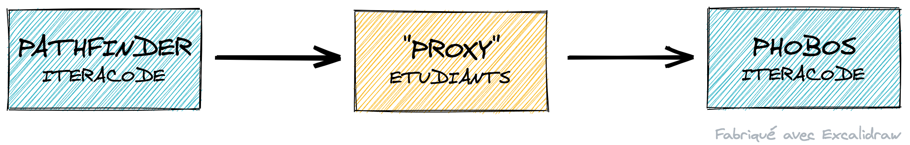

# Résultats de la Nightcode 2019

## C'est quoi ce repository ?

### C'est quoi la Nightcode ?

C'est une soirée de code organisée entre Iteracode et l'IUT Informatique d'Amiens.

De 18h à 6h, des équipes d'étudiants tentent de relever les défis que nous leur proposons.

### Pourquoi un repo dédié ?

Lors de cette Nightcode, nous disposions (comme chaque année) d'un Dashboard nous indiquant l'avancement de chaque équipe.

Mais le thème aurait demander deux "contrôles" par challenge et nous n'avions pas pu mettre en place le second contrôle. Nous n'avions donc que des résultats tronqués.

### C'était quoi le thème ?

Le thème était "Seul sur Mars".

Mark Watney est donc seul sur la planète rouge et s'appuie sur le robot Pathfinder pour envoyer des messages à la Terre.

Un détail du livre (qui n'apparaît pas dans le film), c'est que les messages de Pathfinder ne sont pas faits pour être transmis dans la nouvelle salle de commande. Les équipes de la NASA doivent donc réaliser une passerelle pour convertir les messages du robot et les transmettre à la salle de commande.

Nous avions implémenté un "Pathfinder" qui envoyait régulièrement des messages aux serveurs des étudiants et nous avions un second serveur (nommé Phobos) qui attendait les messages convertis.

Pendant la soirée, le dashboard affichait la bonne prise en compte par le serveur des étudiants des messages de Pathfinder. Mais il n'indiquait si les messages étaient correctement transmis.

Pour dire les choses autrement, pour "valider" tout le dashboard il suffisait de répondre correctement à Pathfinder, pas besoin de transmettre réellement le message.

### Pourquoi sortir les résultats 1 an et demi plus tard ?

Tout d'abord, parce que je n'aime pas laisser une tâche inachevée. J'avais stocké toutes les données le jour même, avec dans l'idée d'y revenir un jour, c'est maintenant chose faite.

Ensuite, le langage que j'utilise pour le "back-end" de Nightcode est du Clojure. J'ai peu l'occasion d'en faire au quotidien. Cette tâche était donc une bonne excuse pour utiliser ce langage.

Il me semblait aussi que certains étudiants avaient plutôt bien réussi et je voulais vérifier.

Enfin, j'aime bien ce sujet et il n'a pas eu le succès que j'espérais. Cet exercice me permet aussi d'envisager un "remake" de cette Nightcode pour une année future.

## Les résultats

| Nom d'équipe         | Défi                     | Réponse à Pathfinder | Envoi à Phobos |
| -------------------- | ------------------------ | -------------------- | -------------- |
| Cod'Heures           | connection-status        | ✅                   |                |
|                      | Connection status Full   | ✅                   |                |
|                      | messages-ok              | ✅                   | ✅             |
|                      | messages-ko              | ✅                   |                |
|                      | Messages type par défaut | ✅                   | ❌             |
|                      | Messages à Maman         | ❌                   | ❌             |
|                      | Messages pour Arnaud C.  | ✅                   | ❌             |
|                      | science-datas-ok         | ✅                   | ✅             |
|                      | science-datas-ko         | ✅                   |                |
|                      | science-datas-raw        | ✅                   | ❌             |
|                      | image-ok                 | ✅                   | ✅             |
| Code blocker         | connection-status        | ✅                   |                |
|                      | Connection status Full   | ✅                   |                |
|                      | messages-ok              | ❌                   | ❌             |
|                      | messages-ko              | ✅                   |                |
|                      | Messages type par défaut | ❌                   | ❌             |
|                      | Messages à Maman         | ❌                   | ❌             |
|                      | Messages pour Arnaud C.  | ❌                   | ❌             |
|                      | science-datas-ok         | ❌                   | ❌             |
|                      | science-datas-ko         | ❌                   |                |
|                      | science-datas-raw        | ❌                   | ❌             |
|                      | image-ok                 | ❌                   | ❌             |
| IScream              | connection-status        | ❌                   |                |
|                      | Connection status Full   | ❌                   |                |
|                      | messages-ok              | ❌                   | ❌             |
|                      | messages-ko              | ❌                   |                |
|                      | Messages type par défaut | ❌                   | ❌             |
|                      | Messages à Maman         | ❌                   | ❌             |
|                      | Messages pour Arnaud C.  | ❌                   | ❌             |
|                      | science-datas-ok         | ❌                   | ❌             |
|                      | science-datas-ko         | ❌                   |                |
|                      | science-datas-raw        | ❌                   | ❌             |
|                      | image-ok                 | ❌                   | ❌             |
| L'agence Touriste    | connection-status        | ✅                   |                |
|                      | Connection status Full   | ✅                   |                |
|                      | messages-ok              | ❌                   | ✅             |
|                      | messages-ko              | ✅                   |                |
|                      | Messages type par défaut | ✅                   | ❌             |
|                      | Messages à Maman         | ❌                   | ✅             |
|                      | Messages pour Arnaud C.  | ✅                   | ❌             |
|                      | science-datas-ok         | ✅                   | ❌             |
|                      | science-datas-ko         | ✅                   |                |
|                      | science-datas-raw        | ✅                   | ❌             |
|                      | image-ok                 | ✅                   | ❌             |
| NullPointerException | connection-status        | ✅                   |                |
|                      | Connection status Full   | ✅                   |                |
|                      | messages-ok              | ✅                   | ✅             |
|                      | messages-ko              | ✅                   |                |
|                      | Messages type par défaut | ✅                   | ✅             |
|                      | Messages à Maman         | ❌                   | ❌             |
|                      | Messages pour Arnaud C.  | ❌                   | ❌             |
|                      | science-datas-ok         | ✅                   | ✅             |
|                      | science-datas-ko         | ❌                   |                |
|                      | science-datas-raw        | ✅                   | ❌             |
|                      | image-ok                 | ✅                   | ❌             |
| PLS-QL               | connection-status        | ✅                   |                |
|                      | Connection status Full   | ✅                   |                |
|                      | messages-ok              | ✅                   | ❌             |
|                      | messages-ko              | ❌                   |                |
|                      | Messages type par défaut | ✅                   | ❌             |
|                      | Messages à Maman         | ✅                   | ❌             |
|                      | Messages pour Arnaud C.  | ✅                   | ❌             |
|                      | science-datas-ok         | ❌                   | ❌             |
|                      | science-datas-ko         | ❌                   |                |
|                      | science-datas-raw        | ❌                   | ❌             |
|                      | image-ok                 | ❌                   | ❌             |
| SlavShlag            | connection-status        | ✅                   |                |
|                      | Connection status Full   | ✅                   |                |
|                      | messages-ok              | ✅                   | ❌             |
|                      | messages-ko              | ❌                   |                |
|                      | Messages type par défaut | ✅                   | ❌             |
|                      | Messages à Maman         | ✅                   | ❌             |
|                      | Messages pour Arnaud C.  | ✅                   | ❌             |
|                      | science-datas-ok         | ❌                   | ❌             |
|                      | science-datas-ko         | ❌                   |                |
|                      | science-datas-raw        | ❌                   | ❌             |
|                      | image-ok                 | ❌                   | ❌             |
| Team Papy            | connection-status        | ✅                   |                |
|                      | Connection status Full   | ✅                   |                |
|                      | messages-ok              | ✅                   | ✅             |
|                      | messages-ko              | ❌                   |                |
|                      | Messages type par défaut | ✅                   | ✅             |
|                      | Messages à Maman         | ✅                   | ❌             |
|                      | Messages pour Arnaud C.  | ✅                   | ❌             |
|                      | science-datas-ok         | ❌                   | ❌             |
|                      | science-datas-ko         | ❌                   |                |
|                      | science-datas-raw        | ❌                   | ❌             |
|                      | image-ok                 | ❌                   | ❌             |
| Windobe              | connection-status        | ✅                   |                |
|                      | Connection status Full   | ✅                   |                |
|                      | messages-ok              | ✅                   | ❌             |
|                      | messages-ko              | ✅                   |                |
|                      | Messages type par défaut | ✅                   | ❌             |
|                      | Messages à Maman         | ✅                   | ❌             |
|                      | Messages pour Arnaud C.  | ✅                   | ❌             |
|                      | science-datas-ok         | ✅                   | ❌             |
|                      | science-datas-ko         | ✅                   |                |
|                      | science-datas-raw        | ❌                   | ❌             |
|                      | image-ok                 | ✅                   | ❌             |

Pour que tout cela vous parle un peu plus, quelques informations sur les défis.

### Les connections

Ce sont de simples routes de "healthcheck". Il n'est pas attendu de transfert vers Phobos.

Cela permet aux étudiants de se familiariser avec la production d'une réponse sur une route donnée.

### Les messages

L'objectif ici est de transmettre des messages. Tous les messages étaient envoyés sur la même route, l'information du type était transmise par un paramètre.

Chaque type de message avait un format différent. Il fallait donc adapter le code en fonction du type.

### Les données scientifiques

Ici, en plus d'extraire les données, il fallait effectuer une conversion (galons en litres, ...).

Dans la version "raw", le corps de la requête était envoyé en plain/text et non plus en JSON.

N.B. J'ai exclu un des types de données. Je m'étais trompé dans l'énoncé, il aurait fallu convertir les ["milli-pirates-ninjas"](https://en.wikipedia.org/wiki/List_of_humorous_units_of_measurement#Pirate-ninja) en kilowatts et non en kilojoules.

### Les images

Une matrice contenant des 0 ou des 1 devait être convertie en image puis transmise sous la forme d'une base 64.

N.B. Les "Cod'Heures" sont à une transposée de matrice près. Je considère toutefois leur résultat comme bon, car ils sont les seuls à être aller si loin et que j'avais fait la même erreur pendant mes expérimentations.
